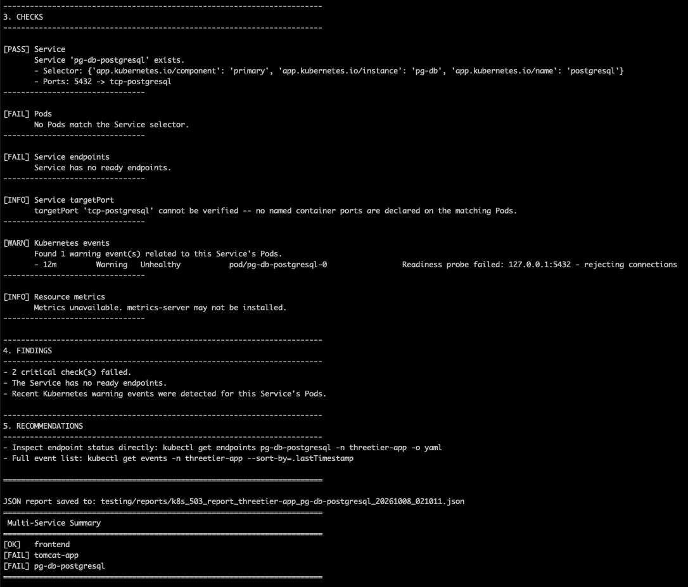

# KubernetesToolKit

A growing collection of tools and scripts to monitor, diagnose, troubleshoot,
and eventually auto-correct issues in Kubernetes clusters and the
applications running on them.

## Tools

### `k8s_503_diagnose.py`

Read-only diagnostic tool for identifying common causes of HTTP 503 errors
in a Kubernetes application exposed via a Service (and optionally an
Ingress).

**Checks performed:**
- Service existence and selector validity
- Pod readiness and phase (including init containers)
- Container waiting/terminated states and restart counts
- Service endpoints, including not-ready endpoints
- Service `targetPort` vs. container port (numeric and named ports)
- Readiness/liveness probe configuration
- Recent Kubernetes warning events scoped to the affected Service/Pods
- Ingress backend routing (if an Ingress name is supplied)
- Pod CPU/memory metrics (if `metrics-server` is installed)

**Requirements:**
- Python 3.9+
- `kubectl`, with a valid kubeconfig/context pointed at the target cluster
- Optional: `metrics-server` for CPU/memory checks

**Flags:**
- `-n` - Namespace the Service(s) live in
- `-s` - Service name to diagnose. Comma-separated list to check every
  tier of a multi-service app (e.g. frontend, app server, database) in
  one run
- `-i` - Ingress name to check (optional). Only checked against the
  first Service when `-s` has more than one

**Usage:**

```bash
python3 k8s_503_diagnose.py -n <Namespace> -s <ServiceName> -i <IngressName>
```

Example (single Service):

```bash
python3 k8s_503_diagnose.py -n production -s payments-api

python3 k8s_503_diagnose.py \
    -n production \
    -s payments-api \
    -i payments-ingress
```

Example (full application stack, one tier failing won't hide behind the
others):

```bash
python3 k8s_503_diagnose.py -n threetier-app -s frontend,tomcat-app,pg-db-postgresql -i frontend
```

**Output:**
- Human-readable diagnostic report on stdout
- JSON report written to `./reports` (configurable via `-o`)

This tool is strictly read-only — it never modifies cluster state.

**Example Output:**

Checking a Postgres Service with zero matching Pods (a real captured run):



Each run also writes a JSON report with the same data — see
[`Report-Example1.json`](Report-Example1.json) for the file behind the
screenshot above.

## Roadmap

Planned additions as the toolkit grows:
- Monitoring helpers (metrics/log aggregation checks)
- General troubleshooting scripts for other common failure modes
  (CrashLoopBackOff, OOMKilled, scheduling failures, network policy denials)
- Opt-in remediation scripts for well-understood, low-risk fixes

## License

MIT - see [LICENSE](LICENSE).
